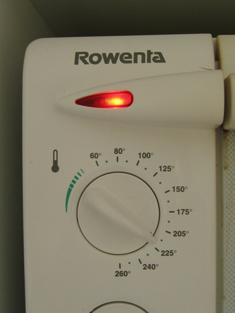

Je suis tombé dernièrement sur un four imaginé par Rowenta qui m'a un peu surpris. Je dis bien «imaginé», parce que je n'ai jamais rien vu de semblable.

Au premier abord, bien sûr, rien d'inhabituel, mais si vous regardez attentivement la séquence de températures possibles, vous avouerez qu'il y a de quoi perdre son latin.

On voit bien au début que l'échelle va de 20° en 20°[^1] puis passe à un écart de 25°[^2] avant de passer à un écart de 30°[^3]…

Même si elle n'est pas systématique, cette progression de l'écart est assez classique, elle permet de limiter l'étendue globale du curseur en augmentant progressivement sa «vitesse» d'évolution. C'est par contre plus courant pour des curseurs de durée, avec les premières minutes réglables finement, par pas de quelques secondes, et les minutes suivantes moins finement réglables.

Après tout, dans le cas de la température, alors que la différence absolue est plus grande, la différence relative entre 175° et 205°[^4] est beaucoup moins importante que celle entre 80° et 60°[^5].

Là où Rowenta fait très fort, et original, c'est qu'après cette progression logique, l'écart entre deux températures successives retombe à 20° [^6] puis 15° [^7] !

On pourrait se dire que Rowenta estime que ces températures sont plus critiques pour ce que vous cuisinez, et qu'il faut plus de précision. Mais alors pourquoi diable retrouve-t-on un écart de 20° ensuite[^8] ?!?!?!

Il me semble[^9] qu'il y a là un vrai gros défaut d'ergonomie, et qu'une marque connue comme Rowenta devrait faire plus attention à ses produits[^10] si elle ne veut pas perdre des points pour son image de marque…

En tout cas, voilà qui prouve que l'ergonomie est un sujet universel et n'est pas cantoné au Web, comme [je l'indiquais récemment](/2006/11/ergonomie-a-revoir-cashstore-fr.html)…

[^1]: de 60° à 100°

[^2]: de 100° à 175°

[^3]: entre 175° et 205°

[^4]: en gros 15%

[^5]: 25%

[^6]: entre 205° et 225°

[^7]: entre 225° et 240°

[^8]: entre 240° et 260°

[^9]: Et je ne pense vraiment pas me tromper !

[^10]: Peut-être complètement sous traités
