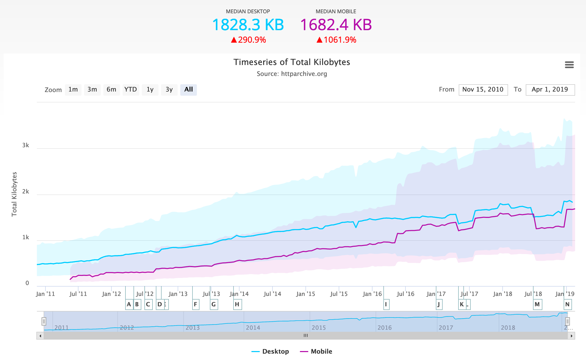

I discovered this article in [Anselm Hannemann](https://helloanselm.com/)'s great [Web Development Reading List](https://wdrl.info/) ([#265](https://wdrl.info/archive/265)).

> So it’s up to networks and cloud providers to push energy efficiency forward—and developers can seize the opportunity to build efficient mobile apps, too. Every megabyte has a cost, even if it’s not readily visible, but it’s easy to forget that. From the solo developer to the cloud hoster, awareness and ownership of energy efficiency is key.

We can passively observe big actors improve their data centers efficency and think it's enough to save us all, but they became huge and impactful mostly because we tend to fill our pages (or let our clients do so) with either [useless crap](https://nicolas-hoizey.com/links/2019/03/death-to-bullshit.html) or useful content lacking a lot of optimizations.

As Web sites/apps architects, designers and developers, we are directly responsible for the [web pages increasing weight](https://httparchive.org/reports/state-of-the-web?start=earliest&end=latest&view=list#bytesTotal), and we should be more careful.

